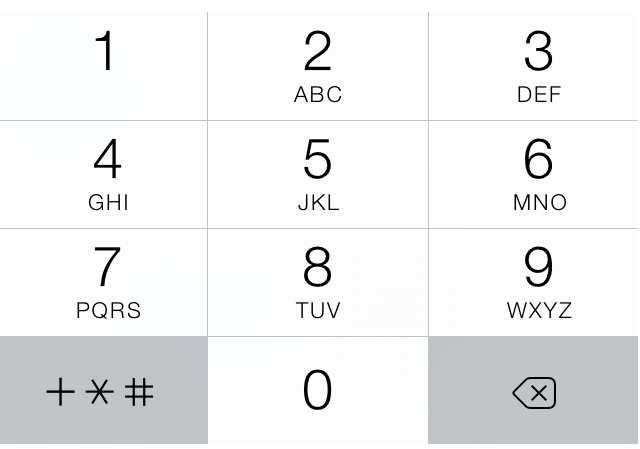

# number-pad

Convert a string to a number based on a classic phone number pad encoding



```
npm install number-pad
```

## Usage

``` js
var numberPad = require('number-pad')
console.log(numberPad('data')) // 3282
```

## License

MIT
